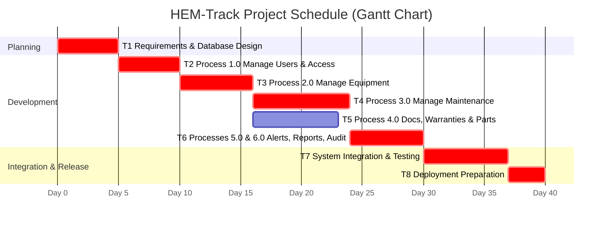

# Gantt Chart

```mermaid
gantt
    title HEM-Track Project Schedule (Gantt Chart)
    dateFormat X
    axisFormat Day %-S
    tickInterval 5second

    section Planning
    T1 Requirements & Database Design            :crit, t1, 0, 5s
    section Development
    T2 Process 1.0 Manage Users & Access         :crit, t2, after t1, 5s
    T3 Process 2.0 Manage Equipment              :crit, t3, after t2, 6s
    T4 Process 3.0 Manage Maintenance            :crit, t4, after t3, 8s
    T5 Process 4.0 Docs, Warranties & Parts      :t5, after t3, 7s
    T6 Processes 5.0 & 6.0 Alerts, Reports, Audit:crit, t6, after t4 t5, 6s
    section Integration & Release
    T7 System Integration & Testing              :crit, t7, after t6, 7s
    T8 Deployment Preparation                    :crit, t8, after t7, 3s
```